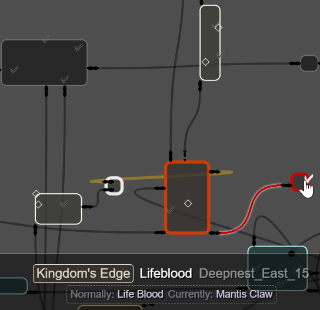

# Tangled Map View

A work in progress, a browser-based map visualizer for Hollow Knight room-randomized runs.

Assuming you have a perfect knowledge of the base game, the goal is to have a system that perfectly remembers and cleanly presents anything you've seen in your current randomized playthrough without spoiling anything (unless you turn on a spoiler option).

Because remembering where anything is with room randomization on is really hard.

## Install

- This depends on [RandomizerMod3](https://github.com/homothetyhk/HollowKnight.RandomizerMod), install that.
- Copy TangledMapView.dll and websocket-sharp.dll to your Hollow Knight mods folder
	- You can get a build from [here](https://github.com/sirbrialliance/TangledMapView/releases) or build TangledMapView.sln.

## Use

- Start the game.
- Open a browser to http://localhost:7900/
	- You can put the map in the background, on another monitor, or even open it on another device on your LAN if you know how.
	- If the map updating/animating hurts game performance, enable "FPS Saver" in the options so it does less when not focused.
- Start or continue a randomized save.
	- The map is blank when you make a new save, start exploring to fill it out.

### General Usage

- Fiddle with the various options on the side to taste. Some have tooltips that explain when you hover over them.
- Map
	- Drag to pan (right drag to pan even if you are hovering a room)
	- Scroll to zoom
- Rooms
	- The current room is highlighted
	- Click a room to select it and get a route to it (but it might be wrong, it doesn't take into account your equipment or game state)
	- Shift-click a room to tell the map to act like you are in that room.
	- Drag rooms try to arrange them a bit better (it doesn't help much).
	- Hover a room to see connections
	- Three types of transitions: 
		- One-way (left): You can normally only travel one way (e.g. falling into Dirtmouth)
		- Normal (center): Normal room transitions.
		- Split room (right): Some rooms have multiple areas that don't ever connect with each other. (e.g. Fungus3_48 with the door to the White Lady that's completely separate from the grub.) These indicators mark doors that enter a different part of the room than the normal markers. <small>(Technically you can bypass this in Abyss_01 with a spicy skip.)</small>
		- Transitions you have taken are colored black. Those you have not are white. Incoming one-way transitions are always black.
- If enabled, the items/checks in a room are shown. Hover for more details.
- Use the search to find things, see the help it provides for more details.

### Room Arrangements

Unlike the original game, the room arrangement with room randomization doesn't cleanly fit on a nice 2D map view. Rooms can connect to other rooms in ways that are physically impossible or illogical. (I even had a save file where the bottom exit of a room connected to the top of the same room!)

To help visualize the room arrangement a few different view options are provided:

- **Islands (cluster)** uses a clustering algorithm to try to determine "groups" of rooms that don't connect to other rooms as much. In theory it sounds useful, in practice I'm not so sure.
- **Islands (hubs & distance)** picks the visible rooms with the most doorways leading in/out and as the main island "centers". (e.g. Dirtmouth has 9 different transitions in/out of it and will often get picked.) Then, we group all the remaining rooms in the island they are "closest" to with "closest" being defined as the number of room transitions it takes to get there. This is a good choice for seeing a general world overview.
- **Areas (Randomizer)** groups based on what the Randomizer considers an "area" for area randomization.
- **Areas (Cornifer)** groups based on the coloring of each room in Cornifer's maps and/or what makes sense in-game.
- **Player-centric** picks the knight's current room as the "center" of our grouping and shows all nearby rooms, up to a certain number of transitions away. It doesn't show everything we know, just what's nearby.
- **Tangled Mess** doesn't group rooms at all. It just throws everything into a giant pile, which generally results in a tangled spider-web mess of rooms and connections going everywhere. When you get frustrated with how things look with the other options, switch to this for a moment of reflection. Arranging the rooms in a way that's visually easy to parse is actually kind of hard!

## Known Issues

- Stag station showing/routing isn't fully implemented yet
- Collected items don't appear right on new saves until you've saved and refreshed the page
- `Crossroads_01` "has a bench", possibly other issues with the data pull
- have to refresh page to find your shade in search
- items in search that are irrelevant to your settings don't show correct "gotten" status
- taking non-standard transitions (e.g. elevator, tram) don't mark transition visited (maybe refresh the page)

# Dev

## Building

- Install the modding API and Randomizer4.0
- If needed: crack open `Mod/TangledMapView.csproj` and make sure the paths to the Hollow Knight installation match up with your installation
- Build `Mod/TangledMapView.csproj`
- Copy/symlink/etc. `Mod/bin/(Debug or Release)/TangledMapView.dll` to your mods directory.

## Data Build

Map:

- Enable MappingCamera in local build
- Symlink exported .unity scenes folder to [hollow knight dir]/SrcScenes
- Start game, load a save
- Enable noclip and invincible via DebugMod
- ctrl+shift+F11
- Get lunch
- Inspect [hollow knight dir]/MappingTiles

To rebuild map/game metadata follow the information in metadata/config.py then run the builddata.py script.

